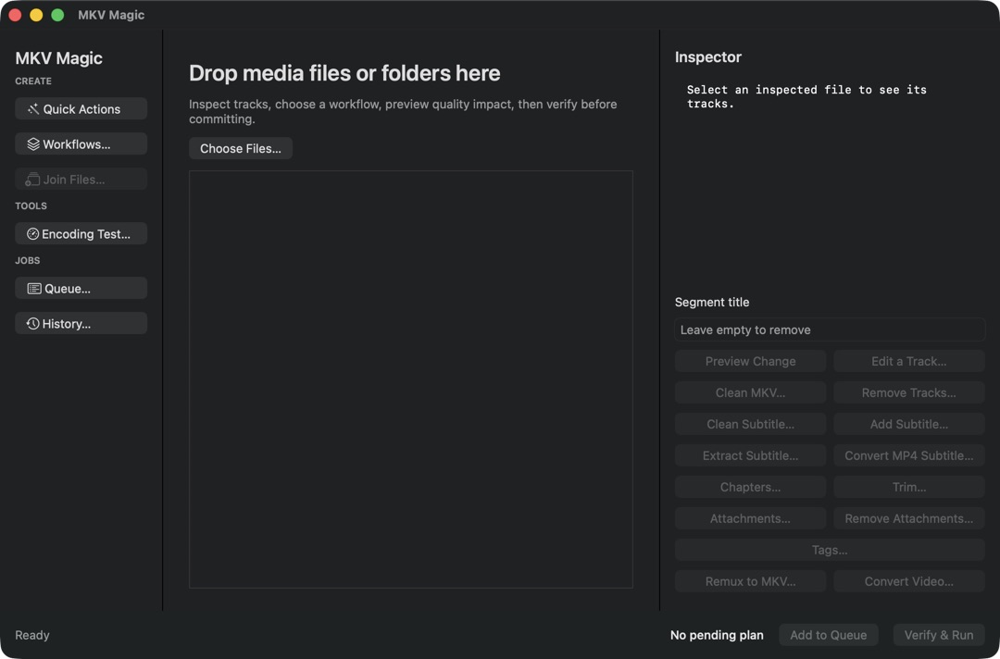
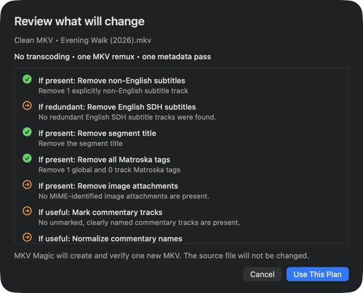
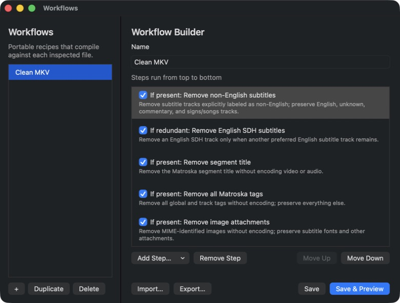
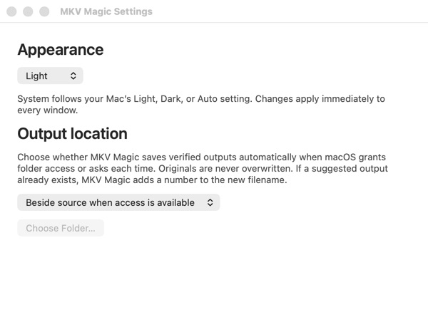
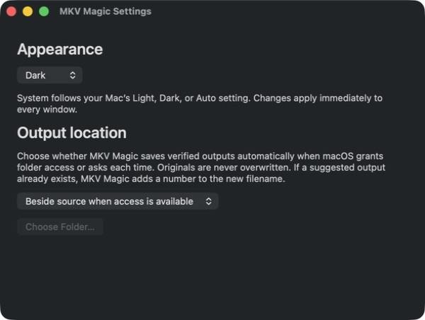
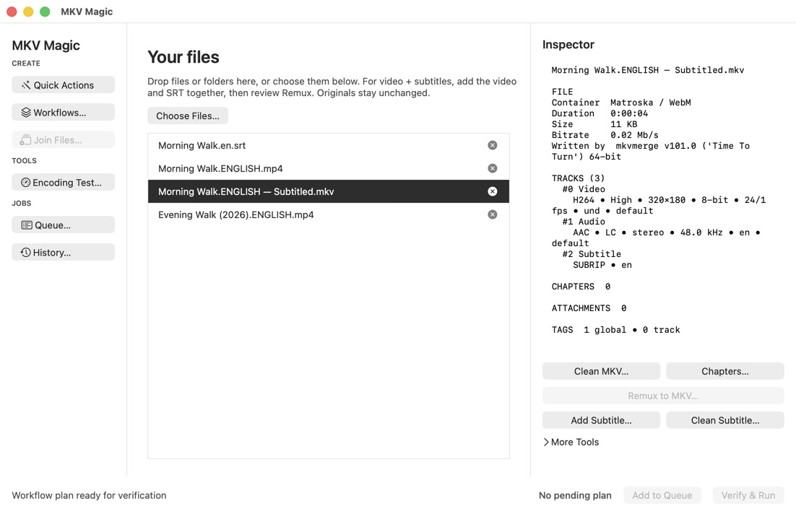
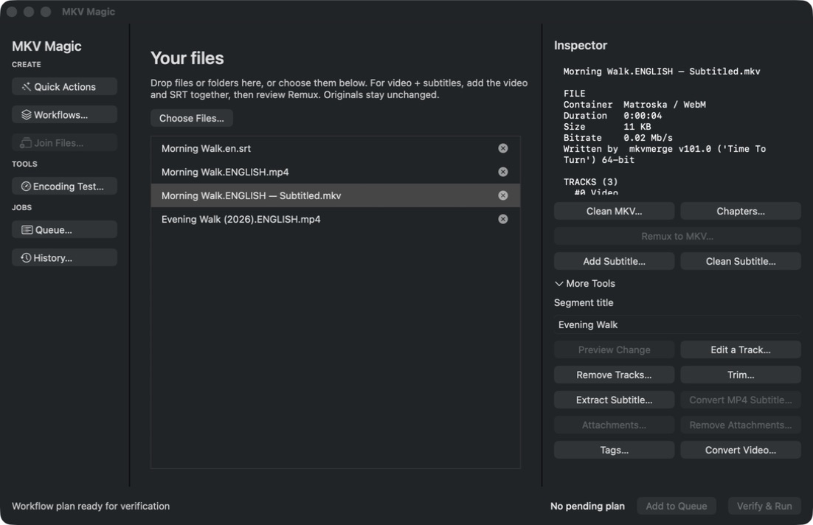

# UX and product-contract review — September 5, 2026

## Scope and evidence

User-approved scope: implement confirmed defects and appearance controls, stay
DRY, simplify the existing native application, and compare it with MKVToolNix
and JMkvpropedit. Appearance is System by default, with optional Light and Dark
overrides and minimal status color. This is not authorization to ship every
unfinished feature in the original product specification or publish a release.

The review combines the current product specification, README, common-flow
matrix, previous native UX regression ledger, application/planner/executor
source, current-run native screenshots and interactions, and generated local
media. No private library media was needed. References were read, not executed
or added as dependencies. Existing unrelated changes were preserved.

Baseline: the running 0.3.0-test.13 candidate, using a four-second H.264/AAC
fixture, English/Spanish subtitles, two chapters, a text attachment, and tags.
Screenshots were captured through native UI automation, then inspected as saved
images. The audit distinguishes rendered/manual evidence from automated tests;
neither is a physical Intel or public-release acceptance claim.

## Reference lessons

| Reference | Observed pattern | Application here |
| --- | --- | --- |
| MKVToolNix GUI | Dedicated multiplexing, information, header, chapter, and job tools; validated edits; separate pending jobs and results. | Keep tools reachable and grouped; make readiness and review outcomes explicit. Preserve the app's stronger verified-copy transaction rather than copying in-place editing. |
| JMkvpropedit | Batch input list and ordering; General/Video/Audio/Subtitles/Attachments groups; explicit opt-in property changes; processing output. | Preserve multi-selection and per-file review. Distinguish unchanged fields and already-satisfied steps from errors. Group advanced operations instead of presenting every disabled control at intake. |
| Apple appearance/accessibility guidance | Adaptive colors, system appearance, recognizable native controls, testing both appearances and increased contrast. | One app-level override, one shared palette, native control/selection/focus behavior, measurable text contrast, and real rendered checks. |

Sources: [MKVToolNix GUI manual](https://mkvtoolnix.download/doc/mkvtoolnix-gui.html),
[MKVToolNix source](https://codeberg.org/mbunkus/mkvtoolnix),
[JMkvpropedit repository](https://github.com/BrunoReX/jmkvpropedit),
[Apple Dark Mode guidance](https://developer.apple.com/design/human-interface-guidelines/dark-mode),
[native accent-color configuration](https://developer.apple.com/documentation/bundleresources/information-property-list/nsaccentcolorname).
The reference revisions inspected were MKVToolNix
`46e32c5d0448ad38911759cfae7d8b43b2830c2a` and JMkvpropedit
`97af80eca331d2a671c6531def8df463448c5cff`. JMkvpropedit is archived; its batch
interaction model is useful, but its Java implementation and arbitrary advanced
arguments are not appropriate runtime dependencies for this app.

Apple generally prefers system-controlled appearance. The user explicitly
requested optional per-app controls, so System remains the default and setting
it clears the override rather than taking a one-time snapshot. A user's explicit
macOS accent choice can override the app's neutral accent; accessibility and
recognizable focus cues take priority over forcibly removing every colored pixel.

## Confirmed defects and implemented changes

| Priority | Finding | Shared fix and regression |
| --- | --- | --- |
| P1 | Trim appeared to do nothing: JPEG generation rejected limited-range frames; the final sample also sought beyond the last frame's timestamp. | Explicit full-range JPEG conversion in the shared thumbnail generator; five interior trim samples instead of duration minus one nanosecond. `TrimThumbnailUXTests` reproduced both real-tool failures before passing. Existing chapter-thumbnail safety tests still reject malformed or unsafe output. |
| P1 | Local preparation/recovery messages were overwritten immediately by ordinary refreshes. | Main-window model status renders on actual state changes, not every readiness/list refresh. `NativeFlowUXTests.testMainStatusRefreshDoesNotEraseActionFailureOrRecoveryGuidance` failed before the fix. |
| P2 | Empty intake displayed a wall of unavailable actions; the inspector gave most of its space to buttons. | Empty-state guidance, common actions first, expandable More Tools, bounded scrolling at small window sizes. Existing actions/readiness/executors are reused. Native light/dark geometry and disclosure tests cover the change. |
| P2 | Segment-title Preview was enabled with no change; editing an accepted title left the old plan runnable. | One live readiness function; typing invalidates the old preview, clearing a title is a valid edit, and status refreshes preserve drafts. Active field-editor regressions cover each transition. |
| P2 | No appearance preference; subdued explanatory text and bright decorative success/no-op colors conflicted with the requested high-contrast design. | Persistent System/Light/Dark at application level; shared adaptive grayscale secondary text and restrained warning/error text; neutral native accent asset. Tests cover persistence, invalid defaults, existing/new windows, immediate settings changes, and minimum layout. |
| P2 | Already-satisfied workflow cards looked like warnings, while pending changes had green completed checkmarks. | Neutral symbols with visible Will apply / Already satisfied / Disabled labels. No planner semantics or review requirements changed. |
| P2 | Inspector reported zero track tags while the tag action reported generated statistics tags. | Inspector now calls the same `MatroskaTagPolicy.counts` used by tag actions. Regression covers flattened MKVToolNix statistics metadata. No new tag parser or duplicate inference rule. |
| P2 | Workflow review still displayed the raw track-tag count after the inspector was fixed. | The compiler retains and displays the shared policy's count instead of recomputing it from raw fields. A regression reproduced the discrepancy; the live fixture now reports the same one global/four track counts in both places. |
| P2 | More Tools remained a right-pointing arrow when expanded and exposed the symbol's "Forward" name to accessibility. | One indicator helper renders its persistent state; the button has its own accessible name. The native disclosure regression failed on both defects before passing. |
| P2 | Completed preparation or a cancelled chapter/trim review could leave "Extracting…" or other obsolete progress text. | Retire each local activity's own message and restore model status on review cancellation, without erasing a newer failure. An overlapping-activity/error regression and live Chapter Studio cancellation cover the distinction. |
| P1 | Automatic queue work stopped after one admitted batch, leaving later jobs waiting for another UI action. | AppModel refills through the same admission coordinator, reads fresh power/thermal conditions and Pause each batch, and does not automatically retry failures. Four real Clean MKV jobs from one start reproduce the old failure, pass on AC/battery, and stop refilling when thermal pressure becomes serious. This does not fix the separate relaunch-permission blocker below. |

Text contrast tests resolve the shared secondary, warning, and error colors
against native window, text, and control backgrounds in Light, Dark, and both
high-contrast appearances, requiring at least 4.5:1. Disabled controls retain
native disabled styling. This is not a claim of full WCAG or VoiceOver compliance.

## Numbered flow review

### Baseline visual evidence (before this pass)

Empty intake exposed every disabled tool:

Workflow preview used warning/success colors for non-error, not-yet-run states:

The existing workflow builder already provides explicit per-step intent:

Baseline screenshot identifiers refer to the local audit evidence folder. They
contain generated fixtures only. Source/automated coverage continues through
the existing [common-flow matrix](COMMON_USER_FLOWS.md) and
[native sweep](NATIVE_UX_SWEEP.md), rather than a duplicate test framework.

| Step | Flow and baseline screenshot | Health / evidence |
| --- | --- | --- |
| 1 | Empty intake and navigation — `01-empty-main.png` | Improved. Choose Files and sidebar destinations are real native controls. Empty disabled action wall removed. |
| 2 | Settings — `02-settings-before.png` | Improved. Output policy remains; appearance controls added using the same native settings window. |
| 3 | File inspection — `03-inspected-mkv.png` | Improved. Track details remain selectable; common actions use less room; statistics-tag summary is consistent. |
| 4 | Clean MKV plan — `04-clean-review.png` | Improved status semantics. Zero-encode impact and preservation text retained. Language-removal naming/default question remains a product decision, not a visual fix. |
| 5 | Track editor — `05-track-editor.png`, `06-track-edit-ready.png` | Healthy in tested state. Valid typing enables Preview immediately; unchanged values explain why it is unavailable. Existing shared layout retained. |
| 6 | Chapter Studio — `07-chapter-studio.png` | Healthy basic outline/numeric editing; advanced toolbar remains dense. A synchronized draggable timeline is not implemented. |
| 7 | Chapter suggestions — `08-chapter-suggestions.png` | Healthy tested layout. No overlapping controls; shared option validation and multi-file source-bound review covered by existing regressions. |
| 8 | Trim preparation — `09-trim.png` | Confirmed failure fixed: old image shows the unchanged main window after clicking Trim. Shared thumbnail fixes and persistent recovery feedback added. |
| 9 | Tags — `10-tags.png` | Explicit export/removal choices and preservation explanation work. Inspector count mismatch fixed through shared policy. |
| 10 | Saved workflows — `11-workflows.png` | Working builder, ordered opt-in cards, save/preview, and per-file compilation. Dense step list is usable but could benefit from later progressive disclosure. |
| 11 | MP4 + subtitle remux | Existing two-input, editable-language, zero-encode workflow retained. Native options, invalid-to-valid recovery, independent queue items, and real-tool packet/subtitle audits are regression-covered. |
| 12 | Track/attachment removal and extraction | Existing bounded choices, no/all-selection guards, exact sidecar extraction, and long-name layouts covered by native and real-tool regressions. No parallel UI or executor added. |
| 13 | Join and common-format fallback | Existing source order, mapping, automatic chapter flattening/number continuation, no-encode append/header repair, and one-generation fallback retained. Real private-library playback is separate acceptance. |
| 14 | Queue, retry, History | Existing persistence, attempt identity/counts, selected details, privacy-safe reporting, and shared History writer retained. Native and concurrent real-tool regressions cover the contracts. |
| 15 | Output destination, commit, cancellation | Existing bookmark grants, collision-safe names, original preservation, verified commit, and explicit Trash consent retained. Failure/cancel tests remain mandatory. |
| 16 | Progress, Help, updates | Existing measured stages and coarse activity where measurement is unavailable retained. Help/selectable documents and manual-only update/security gates remain in the validation pass. |

### Current-run rendered checks and execution evidence

The unlocked follow-up used signed test.14, test.15, and final test.16 candidates.
Their shared appearance/layout changes were inspected in the actual application;
the baseline images above are not the new design. These final test.16 captures
were saved and opened for inspection, and contain only generated fixture media:

| Flow steps | Current-run evidence and limits |
| --- | --- |
| 1–3 | Empty intake, common/expanded actions, existing-window Light/Dark changes, and a compact 820×540 main window checked in test.14. Test.15/16 confirm the corrected More Tools arrow/name and final appearance. A second test.16 drag-resize attempt was blocked by UI automation's `noWindowsAvailable`; it is not additional minimum-size evidence. Automated minimum-size geometry remains covered. |
| 4, 9 | Test.15 Clean MKV review matches the shared one-global/four-track tag count. Neutral Will apply / Already satisfied states remain readable. No cleanup was run on private media. |
| 5–8 | Actual track-name typing enables Preview; Trim opens with five real interior video thumbnails and valid/invalid numeric recovery; Chapter Studio and Suggest options have no overlapping controls in the inspected states. Escape closes nested reviews and test.15 returns to Inspection complete instead of stale extraction text. Tab between text fields was checked, not a complete all-control keyboard/VoiceOver session. |
| 11 | A padded SRT was correctly rejected because MKVToolNix trims its edge whitespace. Clean Subtitle showed the exact before/after change, then created a verified separate SRT. The cleaned SRT with an MP4 succeeded as a queued zero-encode MKV in test.16; English audio/subtitle labels were visible in the reopened result. The original files' SHA-256 digests remained unchanged. |
| 14–15 | Two independent waiting jobs were retained across the UI. One Resume on battery attempted the older job, recorded its inspection failure, and continued to the next job, which succeeded; no jobs remained pending and failed jobs were not retried silently. History details were visible and Command-A selected their text. Fresh Review Again opened the expected language/plan review, but the later output picker was cancelled; a successful retry/Tries increment is not claimed from this manual attempt. |
| 16 | Queue, History, Settings and built-in Help loaded. System was restored after the explicit Light/Dark checks. Scheduled macOS Auto transitions and a full screen-reader session are still untested. |

Detailed local evidence includes captures 20 (Trim), 24–25 (chapters/suggestions),
26–27 (track/remux review), 28–29 (disclosure/count fixes), 32–33 (reviewed SRT
cleanup/History), and 34–35 (waiting jobs and terminal outcomes). Capture 35's
filename says queue-completed, but its two failed rows must not be described as
successful jobs. An early Light capture preceded appearance settling; only the
settled capture and final test.16 captures support the appearance assessment.

### P1 restored queue access — fixed and cold-launch verified in test.17

A queued MP4 + Spanish SRT created in test.15 was resumed after relaunching into
test.16. Its parent-process input/revision checks passed, but the system recorded
an FFprobe `file-read-data` sandbox denial for the unchanged synthetic MP4.
The queue recorded failure during inspection, before History execution or an
output commit. The subsequent newly selected MP4 + cleaned SRT succeeded.

This was a file-access failure, not subtitle corruption or an encoding
requirement. The user approved a focused follow-up. It isolated a second URL
normalization after admission's temporary scope ended: that recreated the URLs
without their bookmark capabilities. Test.17 preserves the already-validated
URLs through the existing balanced execution scope. No sandbox entitlements,
ambient paths, schema changes, or verifier exceptions were added.

The new URL-preservation regression fails with the old behavior and passes with
the fix. A separate signed diagnostic using the production queue coordinator
and verified remux pipeline restored the same synthetic inputs, produced a
verified three-track zero-encode MKV, preserved both originals, cancelled safely
in a second process, and released access after both outcomes. The packaged
test.17 DMG also passed native arm64 launch/tool/fixture checks. The exact app
extracted from that DMG subsequently passed a GUI cold-launch queue test:
Waiting / Tries 0 before quit, Succeeded / Tries 1 after relaunch and one resume,
without reselecting files. Independent inspection confirmed all three expected
tracks and both unchanged source hashes; the persisted History record contains
the full successful lifecycle. See the
[restored queue regression ledger](RESTORED_QUEUE_ACCESS_REGRESSION.md) for the
exact separation between signed diagnostic, GUI, and remaining release evidence.

[Apple's sandbox inheritance guidance](https://developer.apple.com/library/archive/documentation/Miscellaneous/Reference/EntitlementKeyReference/Chapters/EnablingAppSandbox.html)
distinguishes inherited static rights from dynamically acquired file access;
[its current file-access guidance](https://developer.apple.com/documentation/security/accessing-files-from-the-macos-app-sandbox)
describes explicit bookmark access and cross-process permission transfer. Those
were investigation constraints, not the proof of the repair. The signed
before/after reproduction established the narrower URL-lifetime cause. Queue
success was visually checked; the follow-up History-window interaction timed
out, so History completion is based on its persisted record, not a rendered
window check. Clean-account and physical Intel acceptance remain outstanding.

## Intended goals versus current product

The application is not yet a complete implementation of every original-spec
capability. The core safety and common-flow direction is present, with important
coverage and several useful advanced slices; release/hardware acceptance and
the following larger capabilities must remain explicit rather than implied.

| Goal / original scope | Current evidence / remaining work |
| --- | --- |
| Lossless first, at most one encode generation | Deterministic planning and per-stream/packet verification have dedicated unit and real-tool tests. UI fixes do not bypass them. |
| Preserve user media, local-only, no telemetry | Verified-copy/commit boundaries, path/tool manifests, sandbox/network/signature gates are retained. No media uploads, new network client, or runtime dependency added. |
| Novice can add, inspect, choose, review, run | Main empty state/action density, live validation, review status, and disappearing errors improved. Formal novice usability testing is still needed. |
| Bulk metadata editing by track role/position | Portable recipes and several batch actions exist; an arbitrary JMkvpropedit-style bulk property editor is not complete. |
| External input association | One text sidecar and editable language inference work. General multi-subtitle, external-audio, and IDX/SUB association/muxing is not a completed direct flow. |
| Nested chapters and joined chapter chronology | Outline/numeric editing, intervals, local suggestions, import/export, nesting, flattened joins, and sequence numbering exist. Synchronized timeline dragging/snapping is not complete. |
| Splitting | Fast/exact numeric trim exists. General split-by-duration/size/chapter/ranges is not a completed user flow. |
| Attachments and tags | Inspect/extract/remove attachments and export/clear tags exist. Attachment add/replace and arbitrary per-tag editing are not complete. |
| Container outputs | Current verified output flows target MKV. General MP4/MOV/WebM output remains future work with container-specific preservation rules. |
| HDR and image subtitles | Supported preservation paths remain guarded. HLG/HDR10+/SDR-to-HDR and image-to-text OCR must not be implied by generic conversion labels. |
| Queue/history | Durable local JSON actors are implemented, not the original SQLite proposal. This is a documentation correction, not a reason to migrate stable persistence during a UX pass. |
| Diagnostics | Coarse, allowlisted local/exportable facts are implemented. A full sanitized command/raw-log bundle remains deferred; do not weaken privacy to make debugging easier. |
| Native Intel + Apple Silicon release | Universal packaging and native tool checks are automated. Physical Intel, clean-account install, long-run mixed queue, and real playback remain distinct acceptance gates. |

Recommended next product priorities: resolve generic Clean MKV versus English
library naming/defaults, run a short novice task session on both architectures,
then choose between bulk track properties and multi-sidecar remuxing. Treat the
timeline/splitting/attachment-output expansion as separately designed work, not
incidental additions to this review.

## Validation and limitations

The test.16 complete local gate passed source/security/format checks, Universal
builds, coverage, AddressSanitizer, ThreadSanitizer, package checks, and the
disposable signed-update replacement exercise. Normal validation and both
sanitizers each ran 823 tests with one optional private-media skip and no
failures. Coverage ran 823 tests with two skips: private-media acceptance and
the AV1/HEVC capability-dependent join fixture. The latter passed in the normal
and sanitizer runs; its coverage skip is not counted as an execution pass.
Non-UI source line coverage was 89.34%.

An earlier coverage run caught an immediate existing-window appearance
assertion before its update propagated. The focused rerun passed; the test now
asserts the app-level setting immediately and allows at most one second for
each window to inherit the exact expected appearance. The final full gate was
rerun after that test correction. No production appearance workaround or
relaxed color/contrast assertion was added.

Test artifact: **0.3.0-test.16**, build **1788642830**, Universal, Developer ID
signed, **unnotarized and unpublished**. The DMG is 92,825,091 bytes; SHA-256:
`73f230e01bd83dbe7f5c07fcbb885b672496d8349f7e3547fd7e27958c9ce1d5`.
Read-only DMG verification passed layout, the complete Universal Mach-O
inventory, all five bundled native tools, and original-preserving native
fixture/launch checks on arm64. The Desktop DMG copy was byte-compared with the
packaged artifact. The existing installed app was not replaced.

The previously pending locked-Mac appearance pass has now been completed to
the rendered/interaction extent specified above. Those test.16 checks did not
clear the restored-queue sandbox blocker discovered during the GUI pass.

The test.17 follow-up fixes and cold-launch verifies that blocker as documented
above. Its normal, coverage, AddressSanitizer, and ThreadSanitizer runs each
completed 824 tests with one optional private-media skip and zero failures.
The complete local gate also passed source/security checks, Universal packaging,
artifact checksums, and the disposable-key update replacement/rejection exercise.
Non-UI source line coverage remained 89.34%. The exact signed candidate and
remaining acceptance boundaries are recorded in the
[queue regression ledger](RESTORED_QUEUE_ACCESS_REGRESSION.md). It remains a
testing candidate, not a release-ready application.

No publication, notarization, physical Intel launch, complete VoiceOver task
session, system-wide setting change, or private-library playback is inferred
from these checks. Automated appearance inheritance proves clearing the
override; actual scheduled macOS Auto transitions still warrant a manual
overnight check. Clean-account installation, mixed-job long runs, and the
generic Clean MKV versus English-library default decision remain outstanding.
